# 🚀 GGI Backend Challenge - AI Chat & Subscription Management

A production-ready backend system featuring AI chat capabilities with intelligent quota management, multi-tier subscription handling, and comprehensive business logic.

**Developed by:** Ahmed Murtaza  
**GitHub:** [@murtazakhan2595](https://github.com/murtazakhan2595)

---

## 📋 Table of Contents

- [Features](#-features)
- [Architecture](#-architecture)
- [Tech Stack](#-tech-stack)
- [Getting Started](#-getting-started)
- [API Documentation](#-api-documentation)
- [Testing](#-testing)
- [Database Schema](#-database-schema)
- [Business Logic](#-business-logic)
- [Project Structure](#-project-structure)

---

## ✨ Features

### Core Functionality
- 🤖 **AI Chat System** with OpenAI mock integration
- 💳 **Multi-tier Subscriptions** (Basic, Pro, Enterprise)
- 📊 **Intelligent Quota Management** (free + subscription-based)
- 🔄 **Automatic Monthly Reset** for free tier
- 💰 **Flexible Billing** (Monthly/Yearly cycles)
- 🔁 **Auto-renewal** with payment simulation
- 📝 **Complete Chat History** tracking

### Technical Features
- ✅ **Clean Architecture** with DDD principles
- 🔒 **Type-safe** with TypeScript
- 🧪 **Comprehensive Testing** (Unit + Integration)
- 📚 **Swagger/OpenAPI** documentation
- 🐳 **Docker** containerization
- 🛡️ **Error Handling** with custom error classes
- 📊 **Professional Logging** with Winston
- ✔️ **Request Validation** with class-validator

---

## 🏗️ Architecture

### Clean Architecture Overview

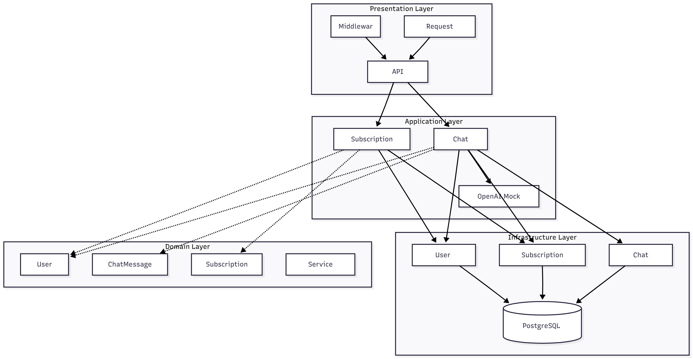

### Module Structure

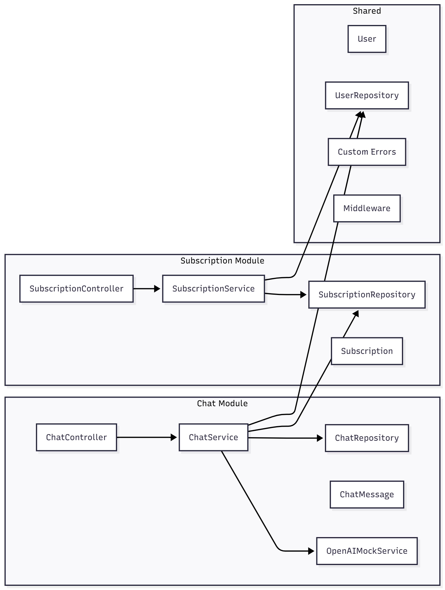

**Key Principles:**
- Separation of Concerns
- Dependency Injection
- Single Responsibility
- Interface Segregation

---

## 🛠️ Tech Stack

| Category | Technologies |
|----------|-------------|
| **Runtime** | Node.js 18+ |
| **Language** | TypeScript 5.x |
| **Framework** | Express.js |
| **ORM** | TypeORM |
| **Database** | PostgreSQL 15 |
| **Validation** | class-validator |
| **Testing** | Jest, Supertest |
| **Documentation** | Swagger/OpenAPI |
| **Containerization** | Docker, Docker Compose |
| **Logging** | Winston |
| **Security** | Helmet, CORS |

---

## 🚀 Getting Started

### Prerequisites

- Node.js 18+ ([Download](https://nodejs.org/))
- Docker Desktop ([Download](https://www.docker.com/products/docker-desktop))
- Git

### Installation

1. **Clone the repository**
```bash
   git clone https://github.com/murtazakhan2595/ggi-backend-challenge.git
   cd ggi-backend-challenge
```

2. **Install dependencies**
```bash
   npm install
```

3. **Set up environment variables**
```bash
   cp .env.example .env
   # Edit .env if needed (default values work for local development)
```

4. **Start Docker containers**
```bash
   docker-compose up -d
```

5. **Wait for PostgreSQL to initialize** (15 seconds)
```bash
   sleep 15
```

6. **Seed the database**
```bash
   npm run seed
```

7. **Start the development server**
```bash
   npm run dev
```

🎉 **Server running at:** http://localhost:3000

---

## 📚 API Documentation

### Interactive Documentation

**Swagger UI:** http://localhost:3000/api-docs

### Quick Reference

#### Chat Endpoints

| Method | Endpoint | Description |
|--------|----------|-------------|
| POST | `/api/chat` | Send message to AI |
| GET | `/api/chat/history/:userId` | Get chat history |

#### Subscription Endpoints

| Method | Endpoint | Description |
|--------|----------|-------------|
| POST | `/api/subscriptions` | Create subscription |
| GET | `/api/subscriptions/:userId` | Get user's subscriptions |
| PATCH | `/api/subscriptions/:id/cancel` | Cancel subscription |
| PATCH | `/api/subscriptions/:id/toggle-autorenew` | Toggle auto-renew |

### Example Requests

**Send Chat Message:**
```bash
curl -X POST http://localhost:3000/api/chat \
  -H "Content-Type: application/json" \
  -d '{
    "userId": "YOUR_USER_ID",
    "question": "What is Clean Architecture?"
  }'
```

**Create Subscription:**
```bash
curl -X POST http://localhost:3000/api/subscriptions \
  -H "Content-Type: application/json" \
  -d '{
    "userId": "YOUR_USER_ID",
    "tier": "PRO",
    "billingCycle": "MONTHLY",
    "autoRenew": true
  }'
```

---

## 🧪 Testing

### Testing Architecture

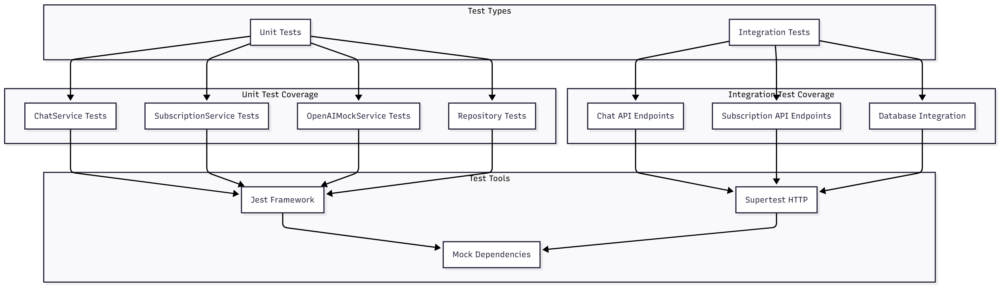

### Test Coverage Overview

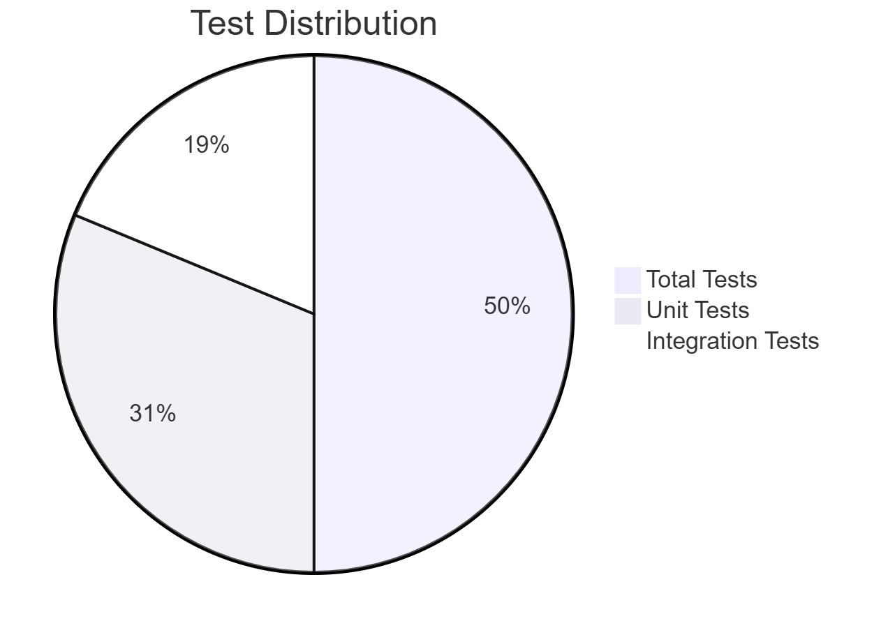

### Run Tests
```bash
# All tests
npm test

# Unit tests only
npm run test:unit

# Integration tests only
npm run test:integration

# With coverage report
npm run test:coverage

# Watch mode (re-runs on changes)
npm run test:watch
```

### Test Coverage

- ✅ **Unit Tests:** Services, Repositories
- ✅ **Integration Tests:** API endpoints
- 📊 **Coverage Target:** >80%

---

## 🗄️ Database Schema

### Entity Relationship Diagram

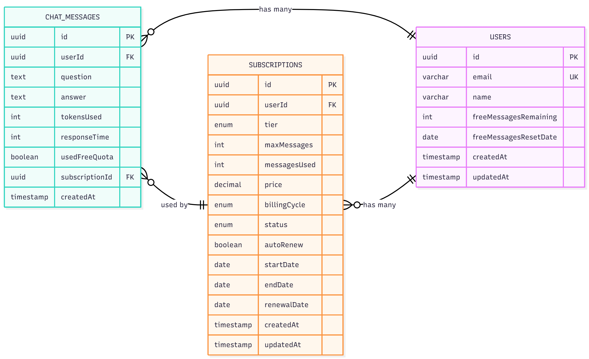

### Database Tables Overview

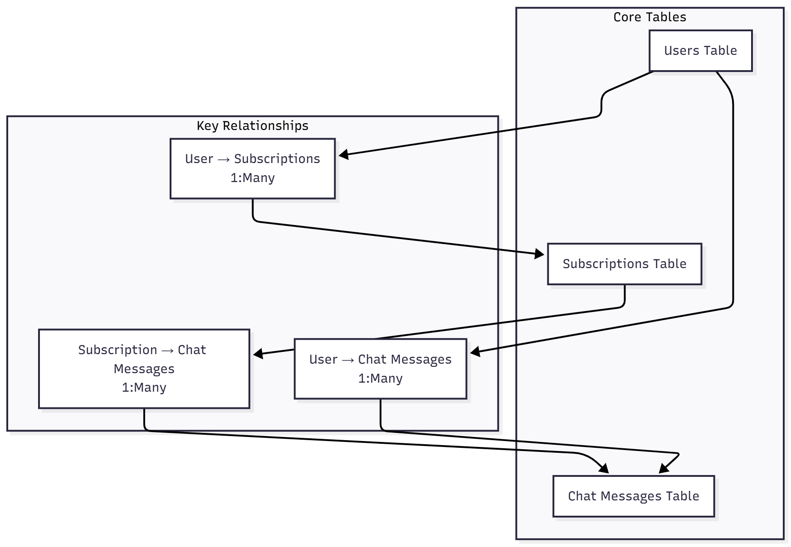

### Users Table
```sql
- id (UUID, PK)
- email (VARCHAR, UNIQUE)
- name (VARCHAR)
- freeMessagesRemaining (INT, default: 3)
- freeMessagesResetDate (DATE)
- createdAt, updatedAt (TIMESTAMP)
```

### Chat Messages Table
```sql
- id (UUID, PK)
- userId (UUID, FK → users.id)
- question (TEXT)
- answer (TEXT)
- tokensUsed (INT)
- responseTime (INT)
- usedFreeQuota (BOOLEAN)
- subscriptionId (UUID, nullable)
- createdAt (TIMESTAMP)
```

### Subscriptions Table
```sql
- id (UUID, PK)
- userId (UUID, FK → users.id)
- tier (ENUM: BASIC, PRO, ENTERPRISE)
- maxMessages (INT)
- messagesUsed (INT, default: 0)
- price (DECIMAL)
- billingCycle (ENUM: MONTHLY, YEARLY)
- status (ENUM: ACTIVE, INACTIVE, CANCELLED, EXPIRED)
- autoRenew (BOOLEAN)
- startDate, endDate, renewalDate (DATE)
- createdAt, updatedAt (TIMESTAMP)
```

### Access Database

**pgAdmin:** http://localhost:5050
- Email: `admin@admin.com`
- Password: `admin`

**CLI:**
```bash
docker exec -it ggi-postgres psql -U postgres -d ggi_backend_test
```

---

## 💡 Business Logic

### Quota Management Flow

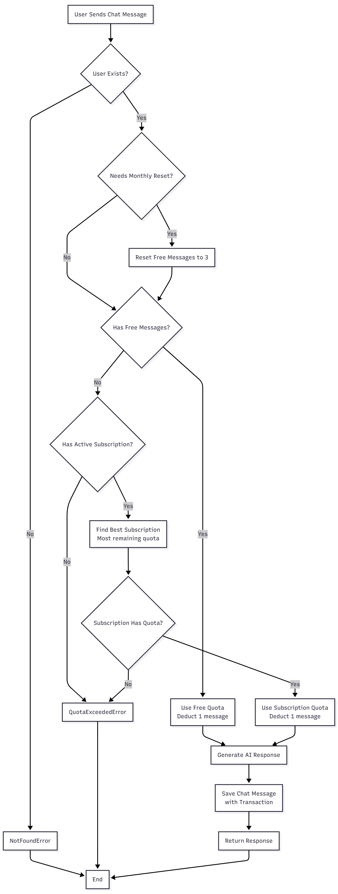

### Subscription Lifecycle

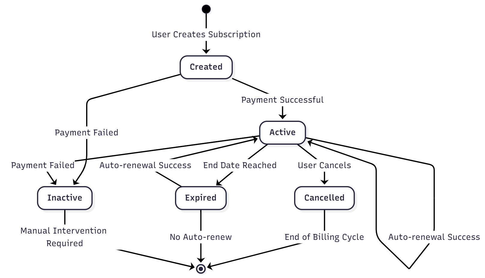

### Auto-Renewal Process

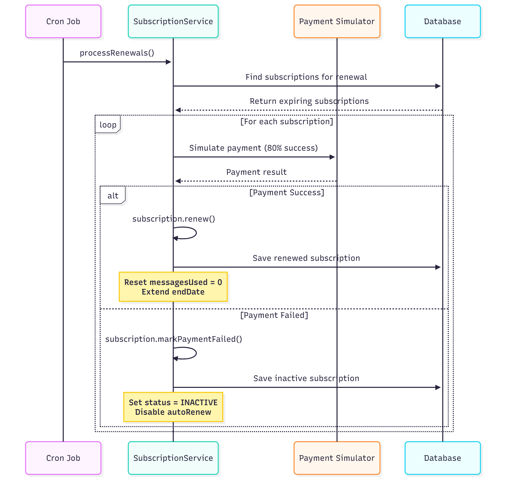

### Quota Management

**Priority System:**
1. ✅ **Free Quota** (3 messages/month)
   - Resets automatically on 1st of each month
   - Used first when available
2. ✅ **Subscription Quota**
   - Used when free quota exhausted
   - Multi-subscription support (uses one with most quota)
3. ❌ **No Quota** → `QuotaExceededError`

### Subscription Tiers

| Tier | Messages | Monthly | Yearly |
|------|----------|---------|--------|
| **BASIC** | 10 | $4.99 | $49.99 |
| **PRO** | 100 | $29.99 | $299.99 |
| **ENTERPRISE** | Unlimited | $99.99 | $999.99 |

### Auto-Renewal

- Configurable per subscription
- Simulated payment processing (20% failure rate)
- Automatic quota reset on successful renewal
- Status changes on payment failure

---

## 📁 Project Structure
```
ggi-backend-challenge/
├── src/
│   ├── app.ts                      # Application entry point
│   ├── database/
│   │   ├── data-source.ts          # TypeORM configuration
│   │   └── seeds/                  # Database seeders
│   ├── modules/
│   │   ├── chat/
│   │   │   ├── controllers/        # HTTP handlers
│   │   │   ├── services/           # Business logic
│   │   │   ├── repositories/       # Data access
│   │   │   ├── domain/
│   │   │   │   ├── entities/       # Domain models
│   │   │   │   └── interfaces/     # Contracts
│   │   │   └── routes.ts           # Route definitions
│   │   └── subscriptions/
│   │       └── (same structure)
│   └── shared/
│       ├── config/                 # Configuration
│       ├── entities/               # Shared entities
│       ├── errors/                 # Custom errors
│       ├── middleware/             # Express middleware
│       ├── repositories/           # Shared repositories
│       └── utils/                  # Utilities
├── tests/
│   ├── unit/                       # Unit tests
│   └── integration/                # Integration tests
├── postman/                        # Postman collections
├── docker-compose.yml              # Docker services
├── tsconfig.json                   # TypeScript config
├── jest.config.js                  # Jest config
└── package.json                    # Dependencies
```

---

## 🐳 Docker Services

### Service Architecture

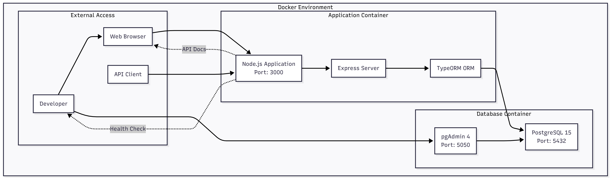

### API Request Flow

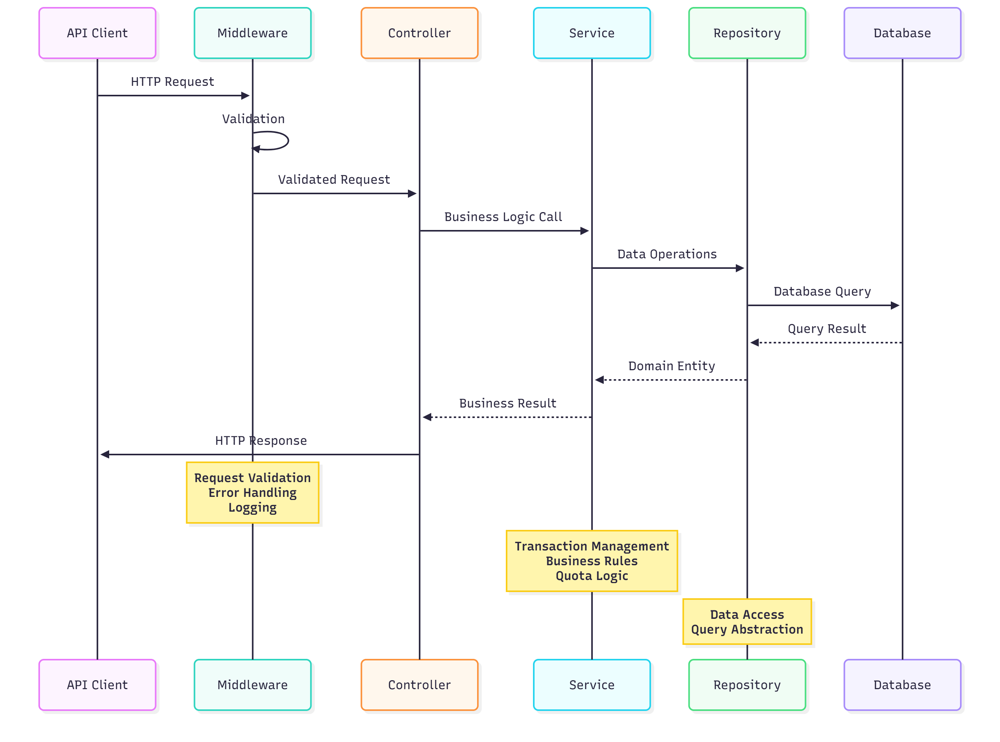

### Running Services
```bash
# Start all services
docker-compose up -d

# Stop all services
docker-compose down

# Stop and remove data
docker-compose down -v

# View logs
docker logs ggi-postgres
docker logs ggi-pgadmin
```

### Services

| Service | Port | Description |
|---------|------|-------------|
| **postgres** | 5432 | PostgreSQL database |
| **pgadmin** | 5050 | Database management UI |

---

## 🔧 Environment Variables
```env
# Application
NODE_ENV=development
PORT=3000

# Database
DB_HOST=127.0.0.1
DB_PORT=5432
DB_USERNAME=postgres
DB_PASSWORD=postgres
DB_DATABASE=ggi_backend_test

# OpenAI Mock
OPENAI_MOCK_MIN_DELAY=500
OPENAI_MOCK_MAX_DELAY=2000

# Business Rules
FREE_MESSAGES_PER_MONTH=3
PAYMENT_FAILURE_RATE=0.2
```

---

## 📊 Scripts
```bash
# Development
npm run dev              # Start development server
npm run seed             # Seed database with test data

# Testing
npm test                 # Run all tests
npm run test:unit        # Unit tests only
npm run test:integration # Integration tests only
npm run test:coverage    # With coverage report

# Docker
docker-compose up -d     # Start containers
docker-compose down      # Stop containers
docker-compose logs -f   # View logs
```

---

## 🎯 Key Features Showcase

### 1. Transaction-Based Quota Management
```typescript
await AppDataSource.transaction(async (manager) => {
  user.deductFreeMessage();
  await manager.save(user);
  
  const message = new ChatMessage();
  await manager.save(message);
  
  // Both succeed or both rollback!
});
```

### 2. Domain-Driven Design
```typescript
class User {
  needsFreeMessagesReset(): boolean {
    // Business logic in entity
  }
  
  resetFreeMessages(): void {
    this.freeMessagesRemaining = 3;
  }
}
```

### 3. Smart Subscription Selection
```typescript
// Finds best subscription to use
const subscription = await subscriptionRepository
  .findAvailableSubscription(userId);
```

---

## 🤝 Contributing

This is a technical challenge project, but feedback is welcome!

1. Fork the repository
2. Create a feature branch
3. Make your changes
4. Write/update tests
5. Submit a pull request

---

## 📝 License

MIT License - feel free to use this project for learning!

---

## 👨‍💻 Author

**Ahmed Murtaza**
- GitHub: [@murtazakhan2595](https://github.com/murtazakhan2595)
- Email: murtazakhan2595@gmail.com

---

## 🙏 Acknowledgments

- GGI (Golden Gate Innovations) for the challenge
- Clean Architecture principles by Robert C. Martin
- Domain-Driven Design by Eric Evans

---

**Built with ❤️ using TypeScript, Express, and PostgreSQL**